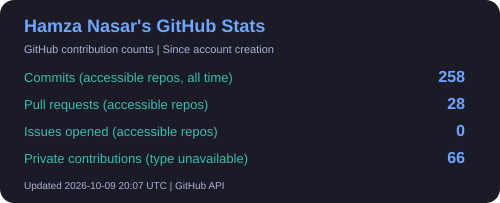
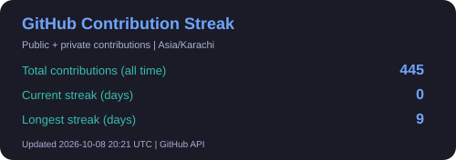

  

**Practical AI. Reliable architecture. Polished product experiences.**

   

**Karachi, Pakistan** · **3+ years of product delivery** · **Available for remote work**

    

---

##  About Me

I'm a **Full Stack AI & SaaS Engineer** with **3+ years of full-stack product delivery**. I build AI agents, voice workflows, SaaS platforms, admin dashboards, and realtime systems with practical architecture and polished UX.

-  **AI agents & automation:** tool calling, command routing, prompt systems, and business workflows with OpenAI and Gemini.
-  **Voice & realtime:** speech input/output, ElevenLabs TTS, WebRTC, LiveKit, Socket.IO, and WebSocket audio bridges.
-  **SaaS products:** authentication, billing, admin consoles, analytics, and SEO foundations.
-  **Backend & data:** NestJS and FastAPI APIs, database migrations, queues, validation, and reliable deployment workflows.
-  **Delivery:** build, test, and verify with Playwright, Vitest, and pytest.

## 🛠️ Skills & Tools

### 🎨 Frontend

**React · Next.js · TypeScript · Tailwind CSS · shadcn/ui · Framer Motion**

### ⚙️ Backend & Data

**Node.js · NestJS · Python · FastAPI · Express · PostgreSQL · MongoDB Atlas · Redis**  
Prisma · TypeORM · SQLAlchemy · Alembic · BullMQ · Zod

### 🤖 AI Agents & Voice

   

Tool calling · Command routing · Prompt systems · Speech input/output · Business automation

### ⚡ Realtime & SaaS

    

Audio streaming · Live dashboards · Runtime metrics · NextAuth & OAuth · Stripe checkout & webhooks · RBAC · Analytics

### 🧪 Testing & Deployment

**Playwright · Vitest · pytest · Docker Compose · Vercel · Railway · Render**  
Security headers · Rate limits · Environment setup · SEO & performance checks

---

## 🌟 Selected Work

<table>
<tr>
<td width="50%" valign="top">

### 🛍️ ReplyPilot AI

**Catalog-aware sales automation**

A sales assistant for clothing stores with seller authentication, catalogs, order capture, chat, and analytics.

`Next.js` `AI Agents` `Seller Dashboard`

 

</td>
<td width="50%" valign="top">

### 🎙️ Kayanne Live Avatar

**Realtime conversational AI**

Microphone input, speech recognition, LLM responses, voice output, and a LiveAvatar stream with session management.

`Next.js` `NestJS` `Voice AI` `LiveAvatar`

</td>
</tr>
<tr>
<td width="50%" valign="top">

### 🎬 VEN

**Vertical Entertainment Network**

A drama streaming platform with discovery, trailers, episode playback, wallet credits, and Stripe payments.

`Next.js` `NestJS` `PostgreSQL` `Redis` `Stripe`

 

</td>
<td width="50%" valign="top">

### 🗣️ Personal Voice Agent

**Local-first voice automation**

Natural speech becomes commands, tool calls, and practical automations through an extensible local runtime.

`Python` `Voice AI` `Command Routing`

</td>
</tr>
</table>

**Also built:**

 

---

## 💼 What I Can Help You Build

| Service | Focus |
| --- | --- |
| 🤖 AI Agents & Workflow Automation | Custom assistants, tool calling, command routers, and business process automation |
| 🎙️ Realtime Voice & Avatar Systems | WebRTC, LiveKit, audio streaming, live chat, and realtime dashboards |
| 🚀 SaaS MVP & Platform Engineering | Authentication, Stripe billing, admin workflows, analytics, and SEO |
| 🗄️ Backend & Data Platforms | APIs, databases, migrations, queues, and validation |
| 📊 Internal Tools & Dashboards | RBAC, inventory interfaces, reports, moderation, and operational consoles |
| 🐳 Deployment & Product Hardening | Docker, environment setup, security headers, rate limits, and deployment checks |

## 🧠 Current Focus

AI agents and voice systems · Realtime product workflows · SaaS platforms · Backend architecture · Production validation

---

## 📊 GitHub Analytics

 

Updated hourly from the GitHub API. Commit, PR and issue counts cover repositories accessible to the token. 
Private activity with unavailable details is shown separately and included in the contribution calendar; it is not assumed to be commits. 
Language statistics cover public repositories. <a href="https://github.com/Hamza-Nasar#contributions" target="_blank" rel="noopener noreferrer">View current GitHub activity</a>.

---

## 📈 Contribution Graph

---

## 🌍 Connect With Me

   

 

<strong>Building practical AI, SaaS, and realtime products — from interface to deployment.</strong>

